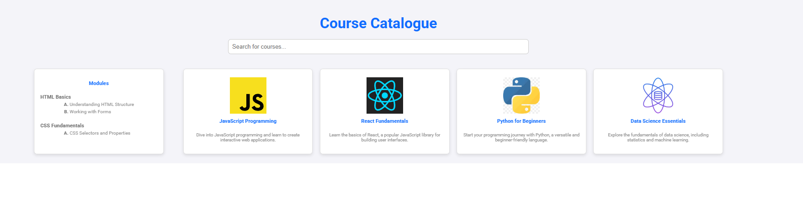

# InGenius — Frontend Technical Assessment (React + TypeScript)

Course catalog UI built as a technical assessment.

# 📸 Preview



## ✨ What’s inside
- Course list with **search/filter**
- **Course details** and **lesson details**
- Client-side navigation with **React Router**
- Component-based UI (CourseCard, SearchBar, etc.)
- Local JSON data (easy to swap to a real API)

## 🧰 Tech stack
React • TypeScript • React Router • CSS

## ▶️ Run locally
```bash
npm install
npm start
```

## 🗂️ Project structure (high level)

src/components/ — CourseCard, CourseList, SearchBar, Details pages
public/ — local data/assets
